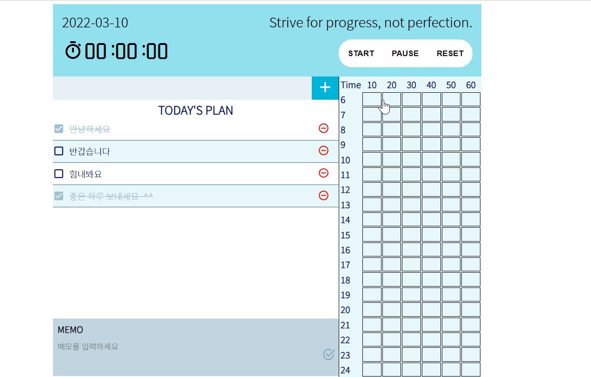

# Study Plan App with Create React App & Redux

리액트를 다루는 기술, 생활코딩! React 프로그래밍 책에서 배운 내용을 토대로 만든 스터디플랜 앱입니다. 스톱워치와 타임테이블, 투두리스트, 메모 기능을 제공합니다. 데이터 관리를 위해 리덕스를 사용했습니다

# Function

1. 스톱워치 (setInterval 기능을 사용해 구현. start, pause, reset 가능)
2. 타임테이블 (클릭을 통해 컬러링 시작. 마우스 hover를 통해 색을 입힐수 있음. 다시 한번 클릭시 편집 모드 종료)  
   2-1. 좌클릭을 통해 삭제 가능. 더블 클릭을 통해 5분 단위로 시간 조정 가능.
3. 메모 기능 (클릭 시 편집 시작)
4. 투두리스트 (삭제, 토글, 추가 가능)

# Dependencies

- react-icons
- react-redux
- redux
- react-table
- styled-components

# Language

- Javascript

# Usage Example

